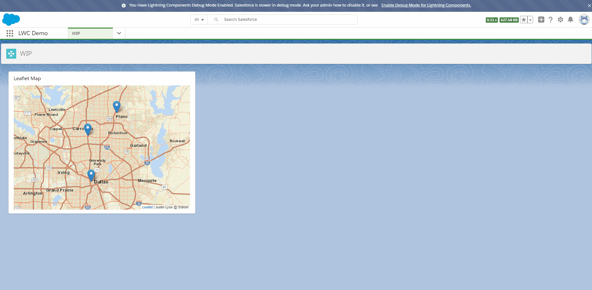

# lwc-leaflet-map

An interactive map using LWCs and Leaflet.

Pass record data with lat/lng geolocation to the leaflet-map, and the leaflet map draws clickable pins on a map.

## Features
 * Set all pins
 * Add a Pin
 * Remove a Pin
 * Resize the map, bounded on the pins
 * onMapInit, event fired when the map is mounted in the component
 * onMarkerClicked, event fired when a pin is clicked, carries the record Id on event.detail.

## Demo



## Usage

```html
<!-- recentContactsMap.html -->
<!-- Pass in a static height -->
<!-- Handle oninit and onmarkerclick -->
<template>
  <c-leaflet-map class="leaflet-map"
    height={height}
    oninit={onMapInit}
    onmarkerclick={onMarkerClick}></c-leaflet-map>
</template>
```
```javascript
import { LightningElement, api, track } from 'lwc'
import getRecentContacts from '@salesforce/apex/RecentContactsMapAuraService.getRecentContacts'

export default class RecentContactsMap extends LightningElement {
  @track contactMarkers
  @track map
  @track error

  @api height

  // When the map is initialized, give it some pins.
  onMapInit () {
    // Store the reference to the map
    this.map = this.template.querySelector('.leaflet-map')
    // Go get contact data from Salesforce Apex
    this.getContacts()
  }

  // Do something when a pin is clicked.
  onMarkerClick (event) {
    const markerClick = new CustomEvent('markerclick', {
      detail: event.detail
    })

    this.dispatchEvent(markerClick)
  }

  getContacts () {
    getRecentContacts()
      .then(data => {
        this.contactMarkers = data
        this.setMapMarkers()
      })
      .catch(error => {
        this.error = error
        this.contactMarkers = null
        console.error('Error getting contacts', error)
      })
  }

  createPins (contacts) {
    return contacts.map(contact => {
      return {
        record: contact,
        lat: contact.MailingLatitude,
        lng: contact.MailingLongitude
      }
    })
  }

  setMapMarkers () {
    this.map.setMarkers(this.contactMarkers)
  }
}
```
